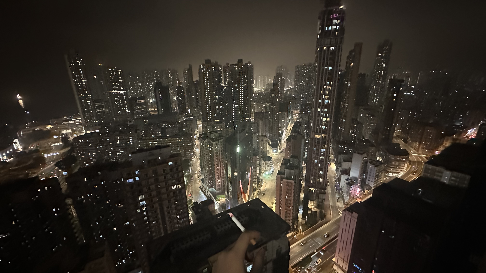
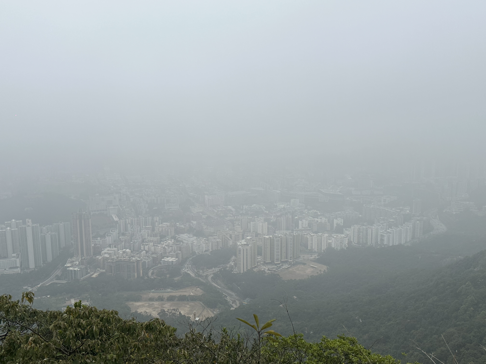
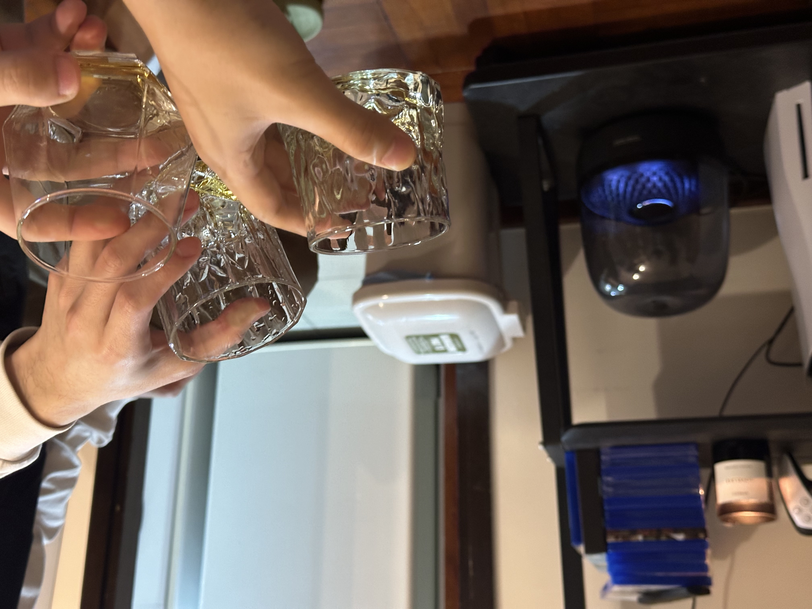

## 爬山

距离上一次远足已经过去了好久好久，前两次一次是去鹤咀，一次是去麦理浩径第二段，这一次我们去了狮子山。

其实最开始是阿培提出来的，我公司的一个同事，也是在做FYP的，也是我认识的第一个香港本地同龄人。阿培人很好，我们见面第一天他就自来熟地和我聊天，而且他的普通话也不是很好，经常念错一些词语然后我去猜他的意思，并纠正他的读音，也正因为如此，我也开始跟他讲广东话哈哈，他也用同样的方式纠正我的读音。

阿培叫了我和另一个和我一起选论文课的来自四川自贡的Jeff，我又叫了老崔和赵子旭，我们五个人周六下午一起去爬山。从乐富上山一直爬到狮子头，然后从黄大仙那边下来，可惜的是当天的天气不太好，雾很大，在山上基本看不到九龙的全貌。

差不多一个小时多一点我们就登顶了，虽然总计也有8公里的路程，但相比起麦理浩径的13公里，还是简单了不少，至少麦径那天爬完，我回家洗完澡就累得直接睡着了，这一次我还能在晚上参加另外的活动。唯一累的点也只是因为全程基本都是上下楼梯，没有平路，旭的体力最差，上山途中休息的时候就已经不怎么说话，独自坐着喘气，阿培也很细心，带了巧克力和其他的糖分给我们。

最难受的是下山的路，由于全是阶梯，我们几个人的膝盖都累得要死，后来发现背对着向后走可以减缓膝盖的疼痛，但是离开山体，从黄大仙走下来的那一长段路（沙田坳）有大概2km的基本上40度的斜坡😅，走得无比艰难。这也是我第一次去黄大仙，香火气息很重，有机会肯定还会再去好好逛逛。

## 乐队聚餐

在上山的过程中，Lee给我发来消息，说他家里没人想一起吃个饭，晚上喝点儿，叫上乐队的几个成员（泽铭和Chris）一起，Chris去陪女朋友了，最后就我们仨人，下了山以后我直接回家冲了个澡然后就去旺角找他们了。

不得不说，旺角的人是真的多，虽然我就住太子，但我很少晚上出来逛过。我们在“快乐小羊”吃了顿火锅（巨贵，一份羊肉，类似于肥牛的那种切法/一份白菜/三份什么滑，类似虾滑的东西，就花了550港币，最后的结果就是没怎么吃饱哈哈。），然后去朗豪坊的超市买了瓶Cloudy Bay的白葡萄酒回Lee家“品鉴”了。

Lee关了大灯，点上了香薰，不得不说他真的是个特别有情调的人，并且具有自己的品味，无论是衣着还是音乐，因为我最近跟着奥鲁在学吉他，听了不少爵士乐，然后泽铭又是一个对爵士情有独钟的鼓手，我便让他再给我推荐一点Artisit。我们连上蓝牙音响，开始放「Bill Evans」、「Art Blakey」、「Nat King Cole」等爵士大师的作品，然后又延伸到对各种音乐类型标准化Artist的探讨推荐，比如新金属的「Rage Against the Machine」或后摇的「Mono」等，还聊到港乐落寞的原因（因为香港的节奏太快了，根本没有人去精雕细琢他们的音乐，亦或者是我们高看了香港，其实他就是一个小地方，怎么可能和整个大陆相比呢），由于Lee和泽铭双双都是PhD，因此我们戏称这是一次乐队内部的学术Conference。

在喝白葡萄酒之前，Lee给我们也拿了威士忌🥃作为“开胃”，具体来说就是激活你的味蕾，但对我这种不懂品酒的粗人来说，有喝的就行哈哈。我们一直聊到十二点半，由于地铁的缘故，不得不走了。

## EDG vs Gen.G

回到家，还有一场瑞士轮的比赛，EDG打Gen.G，GG由于辱华的缘故，官方不给播，我、毛毛、豆豆、谢博还有杜豪在Dank1ng的直播间看比赛，从1点半开始，一直看到
将近5点。结果EDG被让一追二了，感觉是最大概率能进淘汰赛的一场比赛输了，输的还是辱华队，太可惜了，希望下一场好好打吧，不然两支队伍都是马德里一轮游咯。

